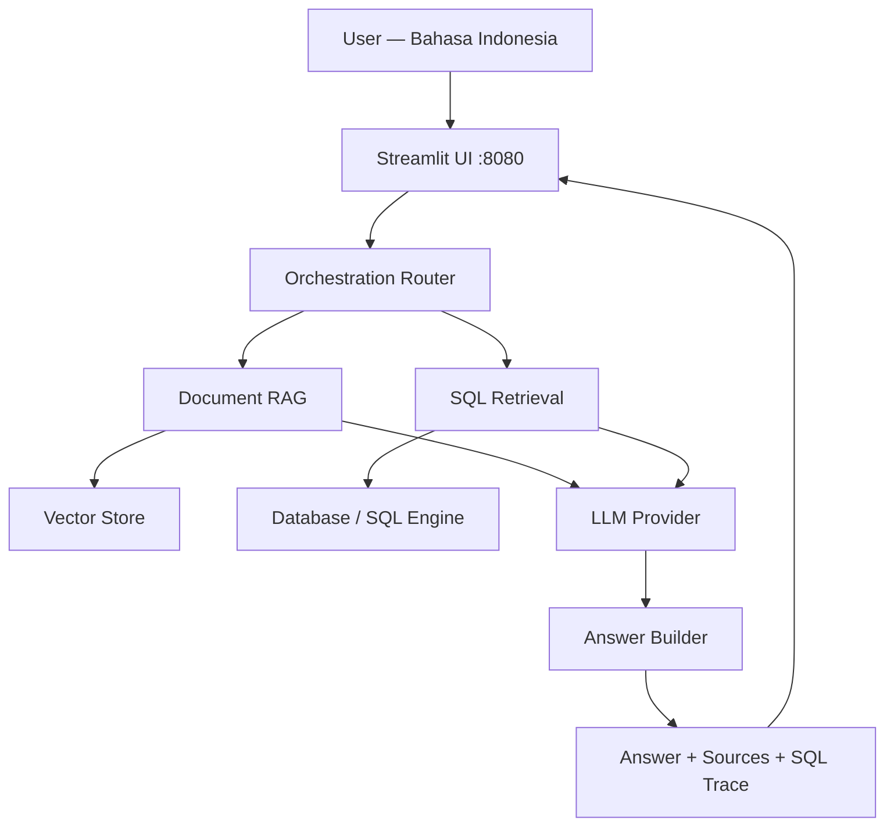

# cloudera-ai-id-rag-demo

A **Bahasa Indonesia enterprise conversational assistant** deployed as a Cloudera AI Application.

The assistant answers questions from enterprise documents (RAG) and structured tables (SQL), with full source traceability. Designed for presales demos in Indonesian banking, telco, and government sectors.

---

## Capabilities

| Feature | Description |
|---------|-------------|
| Bahasa Indonesia chat | Questions and answers in Bahasa Indonesia |
| Document RAG | Answers from PDF, DOCX, TXT, HTML, Markdown |
| Structured data query | Natural language to SQL — read-only with full guardrails |
| Combined answers | Merges document context + table query results in one response |
| Traceability | Shows source documents, excerpts, and executed SQL |
| Cloudera AI deployment | Ready to deploy as a Cloudera AI Application on port 8080 |

---

## Architecture



**Stack:**
- UI: **Streamlit** — single process, port 8080, compatible with Cloudera AI Applications deployment
- Embeddings: pluggable (`intfloat/multilingual-e5-base` default — local, no API key required)
- Vector store: pluggable (FAISS local default, swap to enterprise vector DB for production)
- LLM: pluggable (OpenAI-compatible API — Cloudera AI Inference, local, or cloud)
- SQL: SQLAlchemy + guardrails layer (allowlist + keyword blocklist)

---

## Repository Structure

```
cloudera-ai-id-rag-demo/
├─ CLAUDE.md                     # Project memory and working conventions
├─ README.md
├─ requirements.txt
├─ .env.example
├─ .gitignore
├─ app/
│  ├─ main.py                    # Streamlit entry point
│  ├─ ui.py                      # UI components (Bahasa Indonesia strings)
│  └─ assets/
├─ src/
│  ├─ config/settings.py         # All configuration via env vars
│  ├─ config/logging.py          # Logging setup
│  ├─ llm/base.py                # Abstract LLM interface
│  ├─ llm/inference_client.py    # Cloudera/OpenAI-compatible client
│  ├─ llm/prompts.py             # System prompts in Bahasa Indonesia
│  ├─ retrieval/                 # Document loading, chunking, vector store
│  ├─ sql/                       # SQL guardrails, generation, execution
│  ├─ orchestration/             # Router, answer builder, citations
│  ├─ connectors/                # HDFS, file, database adapters
│  └─ utils/                     # Language helpers, ID generation
├─ data/
│  ├─ sample_docs/               # Demo documents
│  ├─ sample_tables/             # Demo table data (CSV + SQLite seeder)
│  └─ manifests/                 # Ingestion manifests
├─ deployment/
│  ├─ launch_app.sh              # Startup script for Cloudera AI Applications
│  ├─ app_config.md              # Environment variable reference
│  └─ cloudera_ai_application.md # Full deployment guide
├─ tests/
└─ .claude/
   ├─ skills/                    # Reusable Claude Code skills
   └─ history/                   # Session logs, decisions, changelogs, prompts
```

---

## Quick Start (Local Development)

```bash
# 1. Clone and enter the repo
git clone <repo-url>
cd cloudera-ai-id-rag-demo

# 2. Create a virtual environment
python -m venv .venv
source .venv/bin/activate  # Windows: .venv\Scripts\activate

# 3. Install dependencies
pip install -r requirements.txt

# 4. Set up environment variables
cp .env.example .env
# Edit .env with your LLM endpoint and configuration

# 5. Seed the demo SQLite database
python data/sample_tables/seed_database.py

# 6. Ingest sample documents into the vector store
python -m src.retrieval.document_loader

# 7. Run the application
streamlit run app/main.py --server.port 8080
```

Open your browser at `http://localhost:8080`

---

## Sample Demo Prompts (Bahasa Indonesia)

```
Jelaskan ketentuan restrukturisasi kredit berdasarkan dokumen kebijakan terbaru.

Berapa total outstanding pinjaman UMKM wilayah Jakarta pada Maret 2026?

Apakah tren outstanding tersebut sejalan dengan kebijakan ekspansi UMKM dalam dokumen strategi?

Apa syarat pengajuan KUR untuk usaha mikro berdasarkan regulasi terbaru?

Tunjukkan 10 nasabah dengan eksposur kredit tertinggi di segmen korporasi.
```

---

## Deploying to Cloudera AI Applications

See the full guide in [`deployment/cloudera_ai_application.md`](deployment/cloudera_ai_application.md).

Summary:
1. Push repo to Git (GitHub, GitLab, Bitbucket)
2. In Cloudera AI: **Applications → New Application**
3. Select Git repo, set subdomain, choose resource profile
4. Set environment variables from `.env.example`
5. Set **Launch Command**: `bash deployment/launch_app.sh`
6. Deploy — the app will be available at your Cloudera AI URL

---

## Presales Demo Script

1. **Open the app** — chat panel appears with example prompts
2. **Ask about a document**: *"Jelaskan ketentuan restrukturisasi kredit"* → see answer + source document + page info
3. **Ask about data**: *"Berapa outstanding UMKM Jakarta Maret 2026?"* → see answer + executed SQL + data table
4. **Ask a combined question**: *"Apakah tren sesuai kebijakan ekspansi?"* → see answer merging both sources
5. **Show source panel** — full transparency over the basis of every answer
6. **Show SQL trace** — system-generated SQL, not user-entered

---

## License

Internal demo — Cloudera presales use only.
