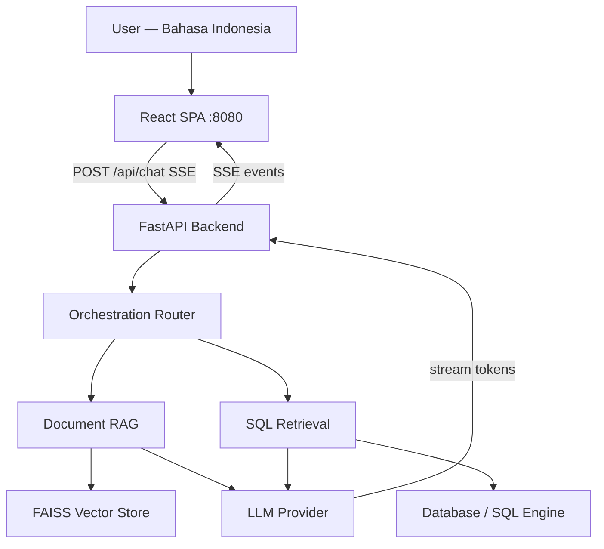

# cloudera-ai-id-rag-demo

A **Bahasa Indonesia enterprise conversational assistant** deployed as a Cloudera AI Application.

The assistant answers questions from enterprise documents (RAG) and structured tables (SQL), with full source traceability and streaming responses. Designed for presales demos in Indonesian banking, telco, and government sectors.

---

## Capabilities

| Feature | Description |
|---------|-------------|
| Bahasa Indonesia chat | Questions and answers in Bahasa Indonesia |
| Document RAG | Answers from PDF, DOCX, TXT, HTML, Markdown |
| Structured data query | Natural language to SQL — read-only with full guardrails |
| Combined answers | Merges document context + table query results in one response |
| Conversation history | Maintains context across up to 3 prior turns |
| Streaming responses | Token-by-token streaming via Server-Sent Events |
| Traceability | Shows source documents, excerpts, and executed SQL |
| Cloudera AI deployment | Ready to deploy as a Cloudera AI Application on port 8080 |

---

## Architecture



**Stack:**
- Backend: **FastAPI + uvicorn** — async, Server-Sent Events streaming, port 8080
- Frontend: **React SPA** — served as static files from `app/static/`, Cloudera brand theme
- Embeddings: pluggable (`intfloat/multilingual-e5-base` default — local, no API key required)
- Vector store: pluggable (FAISS local default, swap to enterprise vector DB for production)
- LLM: pluggable (OpenAI-compatible API — Cloudera AI Inference, local, or cloud)
- SQL: SQLAlchemy + guardrails layer (allowlist + keyword blocklist)

> **Streamlit fallback**: `app/main.py` (Streamlit) is retained for local notebook use.
> The production entry point is `app/api.py` (FastAPI), launched by `deployment/launch_app.sh`.

---

## Repository Structure

```
cloudera-ai-id-rag-demo/
├─ CLAUDE.md                     # Project memory and working conventions
├─ README.md
├─ DEPLOYMENT.md                 # Full deployment guide
├─ requirements.txt
├─ .env.example
├─ .gitignore
├─ app/
│  ├─ api.py                     # FastAPI entry point (production)
│  ├─ main.py                    # Streamlit entry point (local/notebook fallback)
│  ├─ ui.py                      # Streamlit UI components (Bahasa Indonesia strings)
│  └─ static/                    # React SPA build (index.html + assets)
├─ src/
│  ├─ config/settings.py         # All configuration via env vars
│  ├─ config/logging.py          # Logging setup
│  ├─ llm/base.py                # Abstract LLM interface (chat + stream_chat)
│  ├─ llm/inference_client.py    # Cloudera/OpenAI-compatible client with streaming
│  ├─ llm/prompts.py             # System prompts in Bahasa Indonesia + history support
│  ├─ retrieval/                 # Document loading, chunking, vector store
│  ├─ sql/                       # SQL guardrails, generation, execution
│  ├─ orchestration/             # Router, answer builder (two-phase pipeline), citations
│  ├─ connectors/                # HDFS, file, database adapters
│  └─ utils/                     # Language helpers, ID generation
├─ data/
│  ├─ sample_docs/               # Demo documents (kebijakan kredit, OJK, KYC/APU-PPT)
│  ├─ sample_tables/             # Demo table data (CSV + SQLite seeder)
│  └─ manifests/                 # Ingestion manifests
├─ deployment/
│  ├─ launch_app.sh              # Startup script for Cloudera AI Applications (uvicorn)
│  ├─ app_config.md              # Environment variable reference
│  └─ cloudera_ai_application.md # Step-by-step deployment guide
├─ tests/
└─ .claude/
   ├─ skills/                    # Reusable Claude Code skills
   └─ history/                   # Session logs, decisions, changelogs, prompts
```

---

## Quick Start (Local Development)

```bash
# 1. Clone and enter the repo
git clone <repo-url>
cd cloudera-ai-id-rag-demo

# 2. Create a virtual environment
python -m venv .venv
source .venv/bin/activate  # Windows: .venv\Scripts\activate

# 3. Install dependencies
pip install -r requirements.txt

# 4. Set up environment variables
cp .env.example .env
# Edit .env with your LLM endpoint and configuration

# 5. Seed the demo SQLite database
python data/sample_tables/seed_database.py

# 6. Ingest sample documents into the vector store
python -m src.retrieval.document_loader

# 7. Run the application (FastAPI + React SPA)
uvicorn app.api:app --host 0.0.0.0 --port 8080 --reload
```

Open your browser at `http://localhost:8080`

**Streamlit fallback** (local development only):
```bash
streamlit run app/main.py --server.port 8080
```

---

## Sample Demo Prompts (Bahasa Indonesia)

```
Jelaskan ketentuan restrukturisasi kredit berdasarkan dokumen kebijakan terbaru.

Berapa total outstanding pinjaman UMKM wilayah Jakarta pada Maret 2026?

Apakah tren outstanding tersebut sejalan dengan kebijakan ekspansi UMKM dalam dokumen strategi?

Apa syarat pengajuan KUR untuk usaha mikro berdasarkan regulasi terbaru?

Tunjukkan 10 nasabah dengan eksposur kredit tertinggi di segmen korporasi.

Jelaskan prosedur verifikasi identitas nasabah (KYC) sesuai regulasi yang berlaku.
```

---

## Deploying to Cloudera AI Applications

See the full guide in [`DEPLOYMENT.md`](DEPLOYMENT.md).

Summary:
1. Push repo to Git (GitHub, GitLab, Bitbucket)
2. In Cloudera AI: **Applications → New Application**
3. Select Git repo, set subdomain, choose resource profile
4. Set environment variables from `.env.example`
5. Set **Launch Command**: `bash deployment/launch_app.sh`
6. Deploy — the app starts uvicorn on port 8080 (React SPA served automatically)

---

## Presales Demo Script

1. **Open the app** — React chat interface loads with example prompts in the sidebar
2. **Ask about a document**: *"Jelaskan ketentuan restrukturisasi kredit"* → streaming answer + source document panel
3. **Ask about data**: *"Berapa outstanding UMKM Jakarta Maret 2026?"* → streaming answer + executed SQL + data table
4. **Ask a combined question**: *"Apakah tren sesuai kebijakan ekspansi?"* → answer merging both sources
5. **Ask a follow-up**: *"Bandingkan dengan wilayah Surabaya."* → demonstrates conversation memory
6. **Show source panel** — full transparency over the basis of every answer
7. **Show SQL trace** — system-generated SQL, not user-entered

---

## License

Internal demo — Cloudera presales use only.
