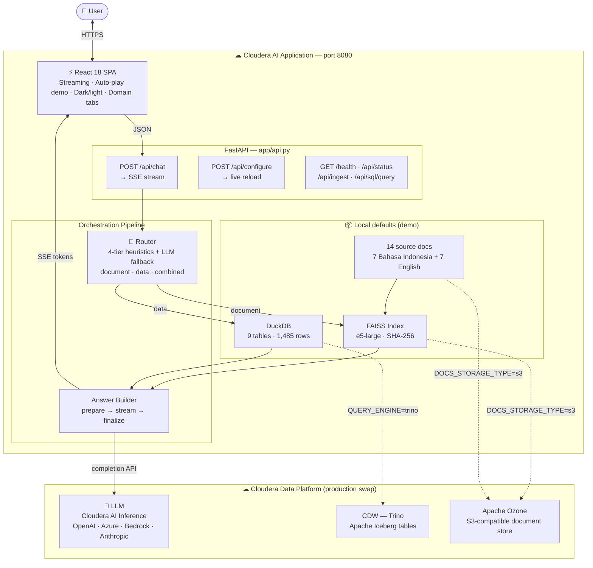
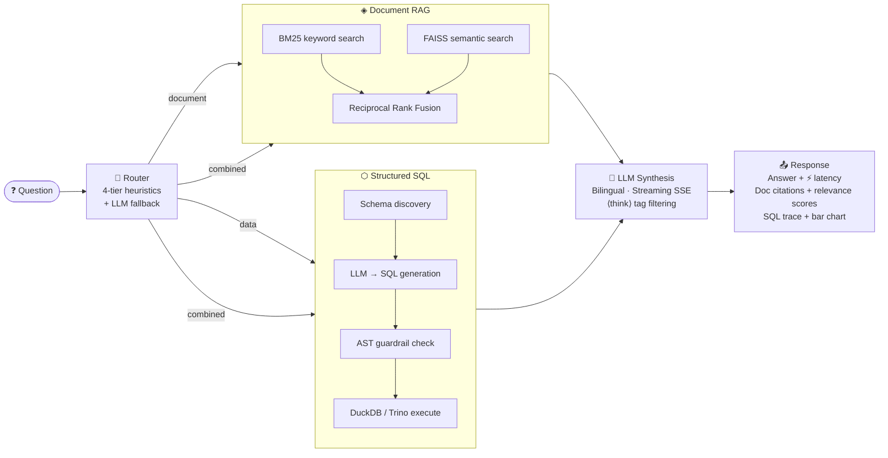

# cloudera-ai-id-rag-demo

An **enterprise conversational assistant** deployed as a Cloudera AI Application.

The assistant answers questions from enterprise documents (RAG) and structured tables (SQL),
with full source traceability and streaming responses. Designed for presales demos in
banking, telco, and government sectors.

---

## Capabilities

| Feature | Description |
|---------|-------------|
| Multilingual chat | Questions and answers in English or Indonesian — auto-detected |
| Domain selector | Sidebar tabs: 🏦 Banking · 📡 Telco · 🏛 Government |
| Document RAG | Answers from TXT, PDF, DOCX, HTML, Markdown with source preview |
| Structured data query | Natural language to SQL — read-only with full guardrails |
| Combined answers | Merges document context + table query results in one response |
| Conversation history | Maintains context across prior turns |
| Streaming responses | Token-by-token streaming via Server-Sent Events |
| Keyword highlighting | Matched query words highlighted in source chunk previews |
| Demo auto-play | "▶ Run Demo" walks through all sample prompts; ⏸ Pause / ▶ Resume / ⏹ Stop |
| Response latency badge | `⚡ X.Xs` displayed on every assistant message |
| Inline bar chart | SQL results with 2–12 rows rendered as a Canvas bar chart |
| Domain-aware welcome | Clickable sample prompts on the welcome screen per selected domain |
| Keyboard shortcuts | Ctrl+Shift+D (demo), Ctrl+K (clear), Ctrl+Shift+R (full reset), Escape (stop) |
| Full demo reset | ↺ Reset Demo button restores domain + language + clears history |
| Chat persistence | Chat history survives page refresh via `localStorage` |
| Configure wizard | Set LLM credentials via browser UI at `/configure`; inline Test LLM |
| Model suggestions | Provider-aware model ID dropdown suggestions in `/configure` |
| .env download | Export current (non-secret) config as a `.env` file from `/configure` |
| Health dashboard | `/setup` shows live status, startup banner, in-app log viewer, QR code, Re-ingest button |
| First-launch overlay | Setup guide shown automatically when LLM is not yet configured |

---

## Architecture

### System overview



### Request pipeline



### Stack

| Layer | Technology |
|-------|-----------|
| **Serving** | FastAPI + uvicorn · async · SSE streaming · port 8080 |
| **Frontend** | React 18 SPA · htm tagged templates · no build step required |
| **Embeddings** | `intfloat/multilingual-e5-large` (local, 560 M params, ID + EN) or OpenAI |
| **Retrieval** | BM25 + FAISS cosine similarity · Reciprocal Rank Fusion |
| **SQL (demo)** | DuckDB · Parquet files · 9 tables · read-only with AST guardrails |
| **SQL (production)** | CDW — Trino + Apache Iceberg on Ozone |
| **Document store (demo)** | Local filesystem |
| **Document store (production)** | Apache Ozone (S3-compatible) |
| **LLM** | Pluggable — Cloudera AI Inference · OpenAI · Azure · Bedrock · Anthropic |

### Connector swap — demo ↔ CDP

| Demo default | Cloudera CDP equivalent | Env var |
|---|---|---|
| DuckDB + Parquet files | CDW — Trino + Apache Iceberg | `QUERY_ENGINE=trino` |
| Local filesystem | Apache Ozone (S3-compatible) | `DOCS_STORAGE_TYPE=s3` |

No code changes required — connector swap is purely configuration.

---

## Cloudera CDP Mapping

| Demo component | Cloudera CDP equivalent |
|---|---|
| Apache Ozone (S3GW) | CDP Object Store — document + warehouse storage |
| Trino + Iceberg | **Cloudera Data Warehouse (CDW)** — virtual warehouse |
| Apache Iceberg tables | **Apache Iceberg** on Ozone (same open table format) |
| FastAPI + uvicorn | **Cloudera AI Application** — serving layer |
| FAISS vector store | Enterprise vector DB (Milvus, Pinecone, etc.) |
| `intfloat/multilingual-e5-large` | Embeddings via Cloudera AI Inference |
| LLM provider | **Cloudera AI Inference** — any deployed model |

---

## Repository Structure

```
cloudera-ai-id-rag-demo/
├─ CLAUDE.md                     # Project memory and working conventions
├─ README.md
├─ DEPLOYMENT.md                 # Full Cloudera AI deployment guide
├─ Makefile                      # Dev shortcuts: make dev / make test
├─ cdsw-build.sh                 # CML pre-build script (pip install + seed + model cache)
├─ requirements.txt
├─ .env.example
├─ .gitignore
├─ run_app.py                    # CML Application script entry point
├─ eval_all.py                   # 36-question bilingual evaluation runner
├─ app/
│  ├─ api.py                     # FastAPI entry point — all routes
│  ├─ main.py                    # Streamlit entry point (notebook/local fallback)
│  ├─ ui.py                      # Streamlit UI components
│  └─ static/
│     ├─ index.html              # React SPA — chat interface (htm, no build step)
│     ├─ setup.html              # Health dashboard — QR, logs, startup banner
│     ├─ configure.html          # Env-var wizard — Test LLM, model suggestions
│     ├─ cloudera-logo.png
│     └─ vendor/                 # Self-hosted JS (React, htm, DOMPurify, QRCode)
├─ src/
│  ├─ config/settings.py         # All configuration via env vars (pydantic-settings)
│  ├─ config/logging.py
│  ├─ llm/base.py                # Abstract LLM interface
│  ├─ llm/inference_client.py    # OpenAI-compatible client + streaming + ping
│  ├─ llm/prompts.py             # System prompts (bilingual)
│  ├─ retrieval/                 # Document loading, chunking, embeddings, FAISS
│  ├─ sql/                       # SQL guardrails (AST), generation, execution
│  ├─ orchestration/             # Router, answer builder, citations
│  ├─ connectors/
│  │  ├─ db_adapter.py           # Factory: DuckDB (dev) or Trino (CDP)
│  │  ├─ trino_adapter.py        # Trino Python client (Iceberg on CDW)
│  │  ├─ ozone_adapter.py        # boto3 S3 client (Apache Ozone / S3-compatible)
│  │  └─ files_adapter.py        # Local filesystem adapter (dev mode)
│  └─ utils/                     # Language helpers, ID generation
├─ data/
│  ├─ sample_docs/
│  │  ├─ banking/                # 6 documents (3 Bahasa Indonesia + 3 English)
│  │  ├─ telco/                  # 4 documents (2 Bahasa Indonesia + 2 English)
│  │  └─ government/             # 4 documents (2 Bahasa Indonesia + 2 English)
│  ├─ sample_tables/             # Parquet seeder + data generator — 9 tables, 1485 rows
│  └─ .env.local                 # ← written by /configure wizard (gitignored)
├─ deployment/
│  ├─ launch_app.sh              # CML startup: pip → seed → vector store → uvicorn
│  ├─ app_config.md              # Environment variable reference
│  ├─ PRESALES_CHECKLIST.md      # Pre-demo checklist
│  └─ cloudera_ai_application.md # Step-by-step Cloudera AI deployment guide
└─ tests/
   ├─ test_sql_guardrails.py     # 30 tests — AST bypass, CTE, multi-JOIN
   ├─ test_router.py             # 12 tests — classification, error fallback
   ├─ test_retrieval.py          # 17 tests — chunking, citations, mocked store
   └─ test_api.py                # 27 tests — FastAPI endpoints, SSE shape
```

---

## Quick Start

### Option A — Cloudera AI Application (production)

See the full guide in [`DEPLOYMENT.md`](DEPLOYMENT.md).

```
1. Clone repo into a CML Project (Git → HTTPS)
2. New Application → Script: demos/cloudera-ai-id-rag-demo/run_app.py
3. Resource: 4 vCPU / 8 GiB
4. Add env vars: LLM_PROVIDER, LLM_API_KEY, LLM_MODEL_ID
5. Create Application → open /setup to verify all components green
```

For Trino/CDW + Ozone, additionally set:
```
QUERY_ENGINE=trino
TRINO_HOST=<cdw-coordinator-endpoint>
DOCS_STORAGE_TYPE=s3
S3_ENDPOINT_URL=http://<ozone-s3gw>:9878
S3_BUCKET=rag-docs
S3_ACCESS_KEY=...
S3_SECRET_KEY=...
```

### Option B — Local Development (DuckDB + local files)

```bash
# 1. Clone the repo
git clone <repo-url>
cd cloudera-ai-id-rag-demo

# 2. Create a virtual environment
python -m venv .venv
source .venv/bin/activate   # Windows: .venv\Scripts\activate

# 3. One command starts everything
make dev

# OR step by step:
pip install -r requirements.txt
python data/sample_tables/seed_parquet.py
python -m src.retrieval.document_loader
uvicorn app.api:app --host 0.0.0.0 --port 8080 --reload
```

Open **http://localhost:8080** for the chat interface.
Open **http://localhost:8080/setup** to check component health.
Open **http://localhost:8080/configure** to set credentials — use **⚡ Test LLM** to verify.

---

## Configure Wizard (`/configure`)

Set LLM credentials through the browser — no shell access required. Useful on a fresh
Cloudera AI Application deployment before credentials are configured.

**Flow:**
1. Open `http://<app-url>/configure`
2. Select your LLM provider (Cloudera / OpenAI / Azure / Bedrock / Anthropic / Local)
3. Fill in credentials — model ID field shows provider-specific suggestions via `<datalist>`
4. Click **⚡ Test LLM** — sends a test ping and shows provider, model, and latency inline
5. Click **Save Configuration** — writes to `data/.env.local`, applied immediately
6. Click **⬛ Download .env** to export the current (non-secret) config as a `.env` file

**Source badges:**
- 🟢 **From environment** — set via Cloudera AI platform UI, locked
- 🔵 **From saved file** — stored in `data/.env.local` by this wizard
- ⬜ **Not set** — will use code default

---

## Demo Features

### Domain & language selector (sidebar)
- Click **🏦 Banking**, **📡 Telco**, or **🏛 Gov** tabs to switch the active domain
- Toggle **Bahasa Indonesia / English** to switch the response language

### ▶ Run Demo (auto-play)
Click **▶ Run Demo** to walk through all sample prompts automatically (1.8 s pause between answers).
- **⏸ Pause / ▶ Resume** — suspend at any prompt and pick up exactly where paused
- **⏹ Stop** — exit auto-play immediately
- **↺ Reset Demo** — restore domain, language, and clear all history
- Keyboard: **Ctrl+Shift+D** start/stop · **Escape** stop · **Ctrl+Shift+R** full reset

### Response latency & bar charts
- Every assistant response shows a `⚡ X.Xs` latency badge (total round-trip time)
- SQL results with 2–12 rows are rendered as an inline Canvas bar chart

### Source document preview
Expand any citation card with **▼ Show full chunk** to read the complete retrieved text,
with query keywords highlighted in orange.

### Citation relevance scores
Each citation card shows a **relevance badge** (high / med / low) based on the
Reciprocal Rank Fusion score from the hybrid BM25 + FAISS retrieval.

---

## SQL Safety & Guardrails

The assistant executes only **read-only SELECT queries** against an approved table list.

| Layer | What it does |
|-------|-------------|
| Keyword blocklist | Rejects `DROP`, `DELETE`, `UPDATE`, `INSERT`, `ALTER`, `TRUNCATE`, etc. |
| AST table check | Walks the sqlparse AST to extract all tables (subqueries + CTEs), rejects any not in the domain allowlist |
| Multi-statement block | Detects `;`-separated statements; comments stripped first to prevent bypass |
| LIMIT enforcement | Strips any existing `LIMIT` and re-applies a hard cap (default 500 rows) |
| SELECT-only gate | Query must start with `SELECT` after comment stripping |
| Rate limiting | `/api/chat` accepts at most 30 requests per minute per IP |

---

## Running Tests

```bash
pytest tests/ -v
```

| Suite | Tests | Coverage |
|-------|-------|---------|
| `test_sql_guardrails.py` | 30 | SQL injection, subquery bypass, CTE, table allowlist |
| `test_router.py` | 12 | LLM classification modes, aliases, error fallback |
| `test_retrieval.py` | 17 | Chunking, citation building, mocked vector store |
| `test_api.py` | 27 | FastAPI endpoints, SSE stream shape, LLM provider indicators |

**Evaluation** (36 bilingual questions against the running app):
```bash
python eval_all.py
```

---

## Deploying to Cloudera AI Applications

See the full guide in [`DEPLOYMENT.md`](DEPLOYMENT.md).

**Cloudera AI Workbench (CML Applications) — quick reference:**

1. Clone or sync this repo into a CML project via Git (HTTPS recommended)
2. **Applications → New Application**

   | Field | Value |
   |---|---|
   | Script | `demos/cloudera-ai-id-rag-demo/run_app.py` |
   | Kernel | Python 3.10 |
   | vCPU / Memory | 4 vCPU / 8 GiB |

3. Add env vars: `LLM_PROVIDER`, `LLM_API_KEY`, `LLM_MODEL_ID`
4. Click **Create Application** → wait ~3–5 min for first boot
5. Verify at `/setup` — all status cards green

> **Note:** `run_app.py` is a Python launcher that calls `deployment/launch_app.sh`.
> Uses DuckDB + local filesystem by default. Switch to CDW/Ozone via env vars.

---

## Sample Data

9 tables (**1485 rows**), generated deterministically (seed 42):

| Domain | Tables | Highlights |
|--------|--------|-----------|
| Banking | `msme_credit` (540), `customer` (80), `branch` (25) | 15 cities × 3 segments × 12 months, OJK credit quality tiers, 25 branches |
| Telco | `subscriber` (80), `data_usage` (480), `network` (20) | Churn risk scores, ARPU, 80 subscribers × 6 months usage, 20 network stations |
| Government | `resident` (40), `regional_budget` (88), `public_service` (132) | 40 districts, 11 programs × 4 quarters × 2 years, 11 service types × 12 months |

14 documents — 7 Bahasa Indonesia + 7 English:

| Domain | Bahasa Indonesia | English |
|--------|-----------------|---------|
| Banking | `kebijakan_kredit_umkm.txt` · `prosedur_kyc_nasabah.txt` · `regulasi_ojk_2025.txt` | `sme_credit_policy_en.txt` · `kyc_aml_procedures_en.txt` · `ojk_regulatory_summary_en.txt` |
| Telco | `kebijakan_layanan_pelanggan.txt` · `regulasi_spektrum_frekuensi.txt` | `customer_service_sla_policy_en.txt` · `spectrum_network_operations_en.txt` |
| Government | `kebijakan_pelayanan_publik.txt` · `regulasi_anggaran_daerah.txt` | `public_service_standard_en.txt` · `municipal_budget_regulation_en.txt` |

---

## Presales Demo Script

1. **Open the app** — if LLM is not configured, a setup overlay appears with instructions
2. Select a domain (🏦 Banking, 📡 Telco, or 🏛 Gov) and language (ID / EN) from the sidebar
3. **Welcome screen** shows the domain's top 3 sample prompts — click any to fire immediately
4. Click **▶ Run Demo** for a fully automatic walkthrough — no typing required
   - Use **⏸ Pause / ▶ Resume** to pause between prompts for Q&A
   - Use **↺ Reset Demo** to restart from scratch
5. Or ask manually (examples in English mode):
   - *Document*: *"What is the credit restructuring procedure?"* → streaming answer + source panel
   - *Data*: *"Show the top 5 customers by credit exposure"* → answer + SQL trace + bar chart
   - *Combined*: *"Has network utilization in Bali exceeded the SLA threshold?"* → merges both
6. Expand a citation card → **▼ Show full chunk** to show source transparency
7. Open **/setup** to show the live health dashboard — database, vector store, LLM ping
8. Open **/configure** to show how credentials are set without shell access — click **⚡ Test LLM**

---

## License

Internal demo — Cloudera presales use only.
