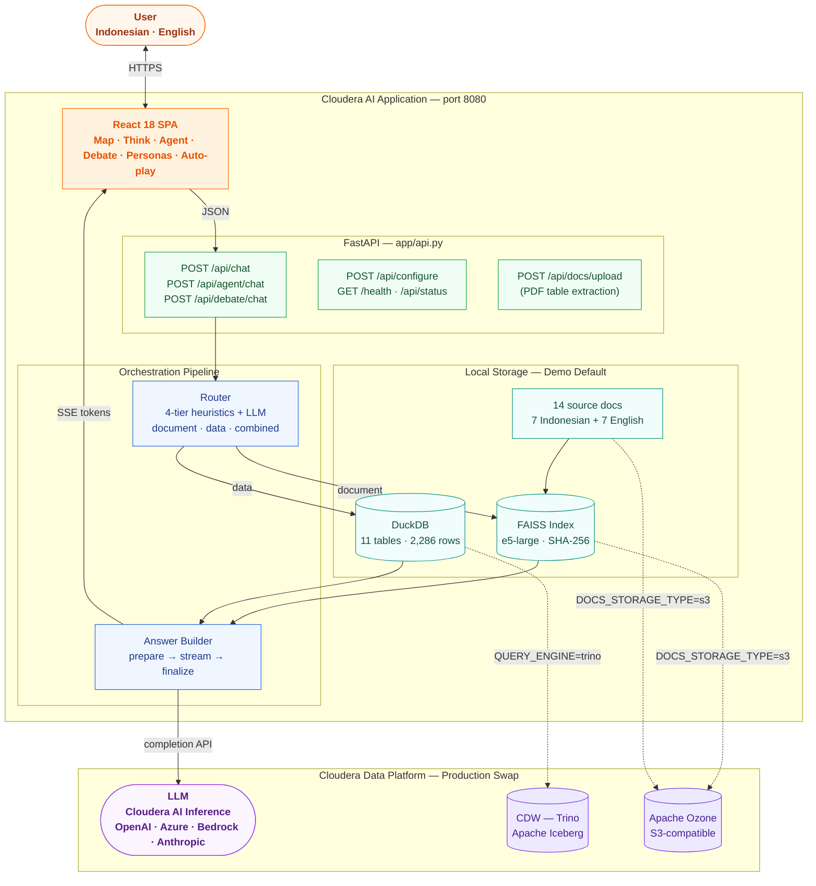

# cloudera-ai-id-rag-demo

An **enterprise conversational assistant** deployed as a Cloudera AI Application.

The assistant answers questions from enterprise documents (RAG) and structured tables (SQL),
with full source traceability, streaming responses, and map visualization. Designed for
presales demos in banking, telco, and government sectors.

---

## Capabilities

| Feature | Description |
|---------|-------------|
| Multilingual chat | Questions and answers in English or Indonesian — auto-detected |
| Domain selector | Sidebar tabs: Banking (◈) · Telco (⬡) · Government (⬢) · All (◉) |
| Document RAG | Answers from TXT, PDF, DOCX, HTML, Markdown with source preview |
| Structured data query | Natural language to SQL — read-only with AST guardrails |
| Combined answers | Merges document context + table query results in one response |
| 3-stage retrieval | FAISS semantic → BM25 keyword (RRF fusion) → cross-encoder reranking |
| **Indonesia Heatmap** | SQL results with city/region/province column auto-render as Leaflet bubble map |
| **Reasoning Mode** | "Think" toggle streams chain-of-thought before the answer (DeepSeek-R1, Claude 4, etc.) |
| **AI Agent Mode** | Multi-step Planner → Executor → Synthesizer with visible research trace |
| **Debate Mode** | Researcher + Critic AI agents debate the answer before synthesis |
| **Document Intelligence** | PDF upload auto-extracts tables → queryable DuckDB views |
| Persona mode | Pre-built personas (Rina / Bank Indonesia, David / Indosat, Budi / DKI Jakarta) |
| Story arcs | Guided multi-turn scenario sequences for demo auto-play |
| Answer styles | Analyst / Executive / Audit response depth modes |
| Follow-up suggestions | 3 contextual follow-up questions after every answer |
| Conversation export | Export full chat history as markdown |
| LLM Profiles | Save / switch named LLM configurations without redeployment |
| Demo auto-play | "▶ Run Demo" walks through all sample prompts; ⏸ Pause / ▶ Resume |
| Response latency badge | `⚡ X.Xs` total round-trip on every assistant message |
| Token usage | `≈ X in · Y out · Z total` per message |
| Map / Bar / Table chart | SQL results rendered as Leaflet map, Canvas bar chart, or markdown table |
| Keyword highlighting | Query words highlighted orange in source chunk previews |
| Confidence bars | Relevance score shown per citation (BM25+FAISS RRF normalized 0–100%) |
| Chat persistence | Survives page refresh via `localStorage` |
| Configure wizard | Set LLM credentials at `/configure`; inline Test LLM |
| Health dashboard | `/setup` — live status, log viewer, startup banner, QR code, Re-ingest |
| Presales slide deck | `/presentation` — 9-slide business + 5-slide technical; audience toggle |
| Uniform icon design | Stroke SVG icons (Feather style) across all pages — no emoji in navigation |
| MLflow observability | Inference latency, token usage, provider logged per run |
| LLM A/B compare | `/explorer` LLM Compare tab — side-by-side provider comparison |
| Iceberg time travel | Historical table snapshots via CDW/Trino (production path) |

---

## Architecture

### System overview



### Stack

| Layer | Technology |
|-------|-----------|
| **Serving** | FastAPI + uvicorn · async · SSE streaming · port 8080 |
| **Frontend** | React 18 SPA · htm tagged templates · no build step |
| **Map** | Leaflet 1.9.4 (self-hosted, offline-safe) · CartoDB tiles |
| **Embeddings** | `intfloat/multilingual-e5-large` (local, 560 M params) or OpenAI |
| **Retrieval** | BM25 + FAISS cosine · Reciprocal Rank Fusion · cross-encoder reranking |
| **SQL (demo)** | DuckDB · Parquet files · 11 tables · read-only AST guardrails |
| **SQL (production)** | CDW — Trino + Apache Iceberg on Ozone |
| **PDF tables** | pdfplumber → DuckDB views with `doc_` prefix |
| **LLM** | Pluggable — Cloudera AI Inference · OpenAI · Azure · Bedrock · Anthropic |

### Connector swap — demo ↔ CDP

| Demo default | Cloudera CDP equivalent | Env var |
|---|---|---|
| DuckDB + Parquet files | CDW — Trino + Apache Iceberg | `QUERY_ENGINE=trino` |
| Local filesystem | Apache Ozone (S3-compatible) | `DOCS_STORAGE_TYPE=s3` |

No code changes required — connector swap is purely configuration.

---

## Repository Structure

```
cloudera-ai-id-rag-demo/
├─ CLAUDE.md                     # Project memory and working conventions
├─ README.md
├─ DEPLOYMENT.md                 # Full Cloudera AI deployment guide
├─ Makefile
├─ requirements.txt
├─ run_app.py                    # CML Application script entry point
├─ app/
│  ├─ api.py                     # FastAPI — /api/chat, /api/agent/chat, /api/debate/chat, ...
│  └─ static/
│     ├─ index.html              # React SPA — chat, map, Think/Agent/Debate toggles
│     ├─ setup.html              # Health dashboard
│     ├─ configure.html          # Env-var wizard + LLM Profiles
│     ├─ explorer.html           # SQL editor, docs browser, LLM Compare, Time Travel
│     ├─ upload.html             # Bulk upload, URL scrape, CSV import, PDF table extraction
│     ├─ metrics.html            # Inference dashboard
│     ├─ presentation.html       # Presales deck — Business (9 slides) + Technical (5 slides)
│     └─ vendor/                 # Self-hosted: React, htm, DOMPurify, Leaflet 1.9.4
├─ src/
│  ├─ config/                    # Settings (pydantic-settings), logging
│  ├─ llm/                       # LLM clients, prompts (bilingual)
│  ├─ retrieval/
│  │  ├─ retriever.py            # Hybrid BM25+FAISS+RRF
│  │  ├─ reranker.py             # Cross-encoder reranking
│  │  └─ table_extractor.py      # PDF table extraction → DuckDB views
│  ├─ sql/                       # Guardrails (AST), generation, execution, metadata
│  ├─ orchestration/             # Router, answer builder (Think/stream/finalize), citations
│  └─ connectors/                # DuckDB, Trino, Ozone, local filesystem
├─ data/
│  ├─ sample_docs/               # 14 source documents (7 ID + 7 EN)
│  ├─ sample_tables/             # seed_parquet.py + sample_data.py — 11 tables, 2,286 rows
│  └─ parquet/                   # Generated Parquet files (gitignored)
├─ deployment/
│  ├─ launch_app.sh              # CML startup script
│  ├─ PRESALES_CHECKLIST.md
│  └─ cloudera_ai_application.md
└─ tests/                        # 86 unit tests (pytest)
```

---

## Quick Start

### Option A — Cloudera AI Application (production)

```
1. Clone repo into a CML Project (Git → HTTPS)
2. New Application → Script: demos/cloudera-ai-id-rag-demo/run_app.py
3. Resource: 4 vCPU / 8 GiB
4. Add env vars: LLM_PROVIDER, LLM_API_KEY, LLM_MODEL_ID
5. Create Application → open /setup to verify all components green
```

### Option B — Local Development

```bash
python -m venv .venv && source .venv/bin/activate
make dev        # pip install + seed + uvicorn --reload
```

Open **http://localhost:8080** — chat interface  
Open **http://localhost:8080/configure** — set LLM credentials  
Open **http://localhost:8080/setup** — health dashboard  

---

## Sample Data (11 tables, 2,286 rows)

Generated deterministically (seed 42). NPL tiers baked in: Java 3–6% · Sumatra/Kalimantan 7–12% · Outer islands 13–22%.

| Domain | Tables | Highlights |
|--------|--------|-----------|
| Banking | `msme_credit` (972) | 27 cities × 3 segments × 12 months, province column |
| Banking | `customer` (80) | industry, annual_revenue, debt_service_ratio |
| Banking | `branch` (25) | npl_amount, deposit_balance, roi_pct, lat/lon |
| Banking | `loan_application` (600) | 25 branches × 3 KUR types × 8 months; approval_rate_pct |
| Telco | `subscriber` (80) | tenure_months, monthly_complaints |
| Telco | `data_usage` (480) | 80 subscribers × 6 months |
| Telco | `network` (27) | avg_latency_ms, packet_loss_pct, lat/lon |
| Telco | `network_incident` (162) | 27 cities × 6 months; sla_breach_count, mttr_hrs |
| Government | `resident` (40) | district/city/province population |
| Government | `regional_budget` (88) | 11 programs × 4 quarters × 2 years |
| Government | `public_service` (132) | pending_count, complaint_count |

14 source documents — 7 Indonesian + 7 English across banking, telco, government.

---

## Chat Modes

| Mode | Toggle | Description |
|------|--------|-------------|
| Standard | (default) | RAG + SQL + combined — single-pass answer |
| **Think** | Think button | Streams chain-of-thought before answer; works with DeepSeek-R1, Claude 4, QwQ |
| **Agent** | Agent button | Planner breaks question into research steps, executes each, synthesizes |
| **Debate** | Debate button | Researcher LLM gathers evidence; Critic LLM challenges; Synthesis resolves |

---

## SQL Safety

Read-only SELECT queries only. Guardrail layers: keyword blocklist → AST table check → multi-statement block → LIMIT cap. All queries logged with latency and row count.

---

## Testing

```bash
pytest tests/ -v     # 86 unit tests
```

---

## License

Internal demo — Cloudera presales use only.
